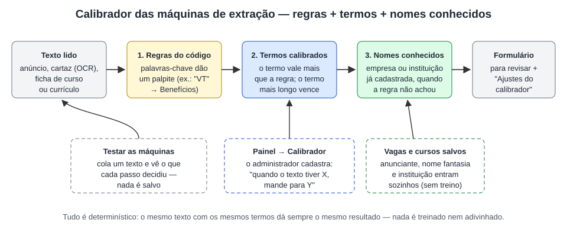

# Calibrador das máquinas de extração — TCC Final · Conecta Vagas DF

Como o administrador ajusta as máquinas de extração (cartaz/anúncio de vaga, ficha de curso e currículo) **sem mexer
no código**. Visão geral do sistema: [ARQUITETURA.md](ARQUITETURA.md).



---

## 1. O problema

As máquinas de extração funcionam por **regras escritas no código**: listas de palavras-chave e padrões. Por exemplo,
se a linha do anúncio tem "VT", "VR" ou "plano de saúde", ela vai para Benefícios; se tem "experiência" ou "CNH", vai
para Requisitos.

Funciona bem, mas tem um limite: todo anúncio escrito de um jeito novo pediria alguém para abrir o código e acrescentar
palavras na lista. "Uniforme fornecido" não tem nenhuma palavra da lista de benefícios, então a regra põe a linha na
Descrição, e a empresa precisa movê-la na mão a cada anúncio parecido.

## 2. A ideia: ajustar sem programar

O **Calibrador** (Painel → aba **Calibrador**, só administrador) tem duas partes:

| Parte | Quem alimenta | O que faz |
|---|---|---|
| **Termos calibrados** (manual) | O administrador, na tela do Calibrador | "Quando o texto tiver o termo X, mande para Y." Ex.: `Uniforme` → Benefícios; `Churrasqueiro` → área Alimentação; `Ensino médio` → Formação. |
| **Nomes conhecidos** (automático) | O próprio sistema, a partir do que já está cadastrado | Empresas (anunciante das vagas e nome fantasia das empresas) e instituições (dos cursos) já cadastradas são reconhecidas sozinhas no texto. Nada para treinar nem atualizar à mão. |

Tudo é **determinístico** (regras + dicionário): o mesmo texto com os mesmos termos dá sempre o mesmo resultado, e cada
decisão do calibrador fica registrada e aparece para quem revisa. Nada é salvo sem revisão: a extração só preenche o
formulário.

## 3. Termos calibrados

### Os 4 contextos (onde o termo age)

| Contexto | Rótulo na tela | Para onde o termo manda | Exemplo |
|---|---|---|---|
| `vaga_linha` | Vaga — linha do anúncio vai para o campo | Descrição / atividades, Requisitos ou Benefícios | `Uniforme` → Benefícios |
| `vaga_categoria` | Vaga — área (categoria) | uma área de vaga ativa (tabela `categorias`) | `Motoboy` → Logística e Transporte |
| `curso_categoria` | Curso / e-book — área (categoria) | uma área de curso ativa | `Power BI` → Marketing, Dados e UX |
| `curriculo_linha` | Currículo — linha solta vai para a seção | Objetivo, Experiências, Formação, Cursos, Habilidades, Competências, Idiomas ou Disponibilidade | `Ensino médio` → Formação |

### Como o termo casa com o texto

- **Sem maiúscula e sem acento**: `CHURRASQUEIRO`, `Churrasqueiro` e `churrasqueiro` são o mesmo termo
  (`Competencias::normalizar`, a mesma normalização do match).
- **Palavra ou expressão inteira**: o termo `vale` pega "Vale transporte", mas não pega "Valeu pela atenção".
- O mesmo termo não entra duas vezes no mesmo contexto (chave única `contexto` + `termo_chave`); a tela avisa e manda
  editar o que já existe.
- **Ativo / inativo**: um termo desativado fica guardado, mas a extração não usa.

### Precedência (quem decide)

1. **A estrutura do próprio texto**: linha que já está debaixo de um título ("Benefícios:", "EXPERIÊNCIA") fica nessa
   seção. O termo de `vaga_linha` e de `curriculo_linha` só age nas **linhas soltas** (sem título de seção). Na ficha de
   curso, o campo `Área:` com uma área cadastrada vale mais que tudo.
2. **O termo calibrado vale mais que a regra do código**, porque foi o administrador quem decidiu.
3. **Vence o termo mais longo** (o mais específico): com `vale` → Requisitos e `vale-refeição` → Benefícios, a linha
   "Vale refeição de R$ 30" vai para Benefícios.
4. Na **área** da vaga, o termo encontrado no **título** manda; sem ele, vale o que aparecer na descrição e nos
   requisitos. No curso é igual: primeiro o título, depois a descrição.
5. **Nomes conhecidos só completam**: a empresa ou a instituição já cadastrada só é usada quando nenhuma regra achou o
   nome no texto.
6. Sem termo que case, **vale a regra do código**, como antes. Se a tabela não existir ou o banco falhar, a extração
   segue só com as regras (e o erro vai para o log).

## 4. Nomes conhecidos (a parte automática)

- **Empresas**: `vagas.anunciante` + `perfis.nome_fantasia` das contas de empresa.
- **Instituições**: `cursos.instituicao`.
- Toda vaga ou curso salvo entra na lista **na hora** (é uma consulta, não um treino).
- Nome genérico não vira nome conhecido: "Loja", "Empresa Teste", "Salário", "Vagas"... (`Calibrador::NOMES_GENERICOS`)
  e nomes com menos de 3 letras ficam de fora. Os mais longos são testados primeiro.
- O relatório mostra a origem: `termo: empresa já cadastrada` ou `termo: instituição já cadastrada`.

## 5. Onde cada máquina usa o calibrador

| Máquina | Termos | Nomes conhecidos | Onde aparece o que o calibrador ajustou |
|---|---|---|---|
| Vaga (cartaz lido no navegador ou anúncio colado) — `ExtracaoVaga` | `vaga_linha` nas linhas soltas; `vaga_categoria` na área | empresa anunciante | Relatório da extração da vaga (Painel → Vagas): bloco **Ajustes do calibrador**, para a empresa e para o administrador |
| Curso / e-book (texto de divulgação ou ficha da pesquisa) — `ExtracaoCurso` | `curso_categoria` na área | instituição | Testar as máquinas |
| Currículo (PDF, DOCX ou DOC) — `ExtracaoCurriculo` | `curriculo_linha` nas linhas soltas do começo (dados pessoais nunca mudam de lugar) | — | Testar as máquinas |

Cada ajuste é registrado como `['campo', 'texto', 'regra', 'para', 'termo']`: o campo (linha, área, empresa, instituição),
o trecho do texto, o que a regra dizia, para onde foi e o termo que decidiu.

## 6. A tela "Calibrador" (Painel → Calibrador)

- **Novo termo**: termo (até 120 caracteres) + "Para onde vai" (lista agrupada pelos 4 contextos) + ativo. Ao salvar:
  *"Termo salvo: já vale na próxima extração."*
- **Testar as máquinas**: escolhe a máquina (vaga, curso ou currículo), cola o texto (até 8.000 caracteres) e vê os campos
  extraídos e a lista **Ajustes do calibrador** ("a regra dizia X; termo: Y"). **Nada é salvo.**
- **Termos calibrados**: lista com subabas por contexto, busca pelo termo ou pelo destino, colunas ordenáveis, chave
  Ativo/Inativo, Editar e Excluir (excluir pede confirmação: a extração volta a seguir só a regra nesse caso).
- **Nomes conhecidos (atualizados sozinhos)**: as empresas e as instituições que a extração já reconhece.

## 7. Termos de exemplo (database/seed.sql)

| Contexto | Termo | Vai para |
|---|---|---|
| vaga_linha | Uniforme | Benefícios |
| vaga_linha | Café da manhã | Benefícios |
| vaga_linha | Lanche | Benefícios |
| vaga_linha | Habilitação | Requisitos |
| vaga_categoria | Churrasqueiro | Alimentação |
| vaga_categoria | Camareiro | Serviços Gerais e Limpeza |
| vaga_categoria | Motoboy | Logística e Transporte |
| vaga_categoria | Promotor de vendas | Vendas |
| curso_categoria | Power BI | Marketing, Dados e UX |
| curso_categoria | Currículo | Carreira e Empregabilidade |
| curriculo_linha | Ensino médio | Formação |
| curriculo_linha | Pacote Office | Habilidades |

## 8. Arquivos (MVC)

| Camada | Arquivo | O que faz |
|---|---|---|
| Service | `app/Services/Extracao/Calibrador.php` | Os 4 contextos, `decidir()` (regra × termo), `termoQueCasa()` (termo mais longo, palavra inteira), `nomeConhecido()` e os nomes genéricos. Carrega os termos uma vez por requisição. |
| Model | `app/Models/CalibracaoDAO.php` | CRUD da tabela `calibracao_extracao`, termos ativos e `nomesConhecidos()` (empresas e instituições já cadastradas). Cria a tabela se o banco veio de uma versão anterior. |
| Controller | `app/Controllers/CalibradorController.php` | Tela do administrador: salvar, ativar/desativar, excluir, filtros e "Testar as máquinas". |
| View | `app/Views/admin/calibrador.php` | Passo a passo, formulário, teste, lista de termos e nomes conhecidos. |
| View | `app/Views/admin/vagas.php` | Bloco "Ajustes do calibrador" no relatório da extração da vaga. |
| Rota | `admin/pages/calibrador.php` → `CalibradorController::painel` | Aba "Calibrador" do painel (só administrador). |
| Usado por | `ExtracaoVaga`, `ExtracaoCurso`, `ExtracaoCurriculo` | Chamam `Calibrador::decidir()` e `Calibrador::nomeConhecido()`. |

## 9. Banco de dados

```
calibracao_extracao
  id           INT PK AUTO_INCREMENT
  contexto     VARCHAR(30)  NOT NULL   vaga_linha | vaga_categoria | curso_categoria | curriculo_linha
  termo        VARCHAR(120) NOT NULL   como o administrador digitou
  termo_chave  VARCHAR(120) NOT NULL   termo normalizado (minúsculo, sem acento)
  destino      VARCHAR(100) NOT NULL   campo da vaga, área ou seção do currículo
  ativo        TINYINT(1)   NOT NULL DEFAULT 1
  usuario_id   INT NULL  → usuarios(id) ON DELETE SET NULL   (quem cadastrou; o termo fica se a conta sair)
  created_at / updated_at
  UNIQUE (contexto, termo_chave)
```

É a 12ª tabela do banco `tcc_final`. Os nomes conhecidos não têm tabela própria: são lidos de `vagas`, `perfis` e `cursos`.

## 10. Roteiro para a apresentação (5 minutos)

Entre como **admin@conectavagas.com / Admin@123**.

1. **Painel → Calibrador**: mostre o passo a passo do topo e os 12 termos de exemplo (subabas por contexto). Mostre também
   os **Nomes conhecidos**: as empresas e instituições que vieram das vagas e dos cursos cadastrados.
2. **Testar as máquinas** → máquina **Vaga**, cole:
   ```
   AUXILIAR DE COZINHA
   Águas Claras
   Salário R$ 1.900 + VT
   Crachá e armário individual
   Uniforme fornecido
   Venha trabalhar no Restaurante Prosa di Minas
   Currículos pelo WhatsApp (61) 99999-0000
   ```
   Resultado: "Uniforme fornecido" vai para **Benefícios** (*a regra dizia Descrição / atividades; termo: Uniforme*), a
   empresa sai como **Restaurante Prosa di Minas** (*termo: empresa já cadastrada*) e "Crachá e armário individual" ainda
   cai na Descrição, porque nenhuma regra nem termo fala de crachá.
3. **Cadastre o termo ao vivo**: Novo termo → `Crachá` → "Benefícios" → Salvar termo.
4. **Teste de novo** o mesmo texto: agora "Crachá e armário individual" também vai para **Benefícios**, com
   *termo: Crachá* nos Ajustes do calibrador. É isso que a banca precisa ver: o administrador ensinou a regra nova sem
   abrir o código.
5. **No uso real**: Painel → **Vagas** → cole o mesmo anúncio em "Extrair" (ou envie um cartaz). O **relatório da
   extração** mostra o bloco **Ajustes do calibrador**, e o formulário já vem com as linhas no lugar certo para revisar.
6. (Opcional) **Currículo**: Testar as máquinas → Currículo, com uma linha solta "Ensino médio completo" logo depois do
   nome: ela vai para **Formação** (termo de exemplo `Ensino médio`).
7. No fim, **desative ou exclua** o termo `Crachá` para deixar a demonstração como estava.

Pergunta comum da banca — *"isso é inteligência artificial?"*: não. É um dicionário de termos mantido pelo
administrador, somado às regras do código e aos nomes já cadastrados. É previsível, explicável (cada ajuste mostra o termo
que decidiu) e auditável (os termos ficam numa tabela, com quem cadastrou).

## 11. Testes

`tests/smoke.php`, seção **2b. Calibrador das máquinas de extração** (termos em memória, sem tocar no banco):
termo que tira "Uniforme" da descrição e põe em benefícios; empresa já cadastrada reconhecida quando nenhuma regra acha;
o termo mais longo vence; palavra inteira; sem acento e sem maiúscula; termo que concorda com a regra conta como regra;
contexto inválido ignorado; nome genérico fora da lista; linha solta do currículo indo para Formação, só o que mudou de
verdade registrado e dado pessoal nunca indo para Experiências. Rodam no `tests\verificar.bat` e antes de cada commit.

## 12. Limites (o que ele não faz)

- Não descobre termos sozinho: só vale o que o administrador cadastrou (e os nomes que já estão no banco).
- Não muda linhas que já estão debaixo de um título de seção, nem dados pessoais do currículo.
- Não corrige o que o OCR leu errado no cartaz: para isso existe a caixa de texto editável da extração da vaga.
- Um termo genérico demais (ex.: `vaga`) mexeria em muitas linhas: prefira expressões específicas e use o
  **Testar as máquinas** antes de ativar.
