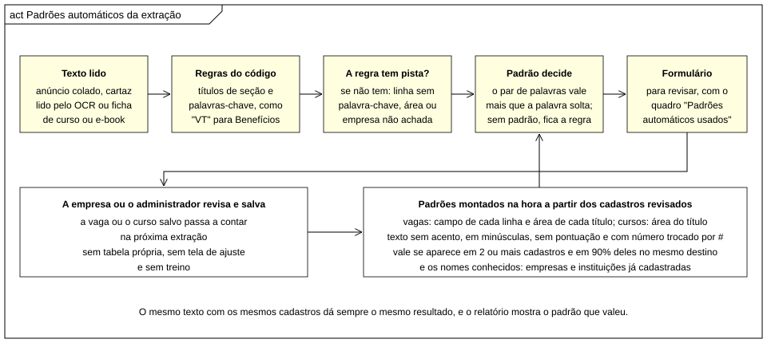

# Padrões automáticos das máquinas de extração

Neste documento explicamos como as máquinas de extração de vagas e de cursos usam o que já está cadastrado para decidir
nos pontos em que as regras do código não têm pista. A visão geral do sistema está em [ARQUITETURA.md](ARQUITETURA.md), e
a referência no código é o comentário da classe `app/Services/Extracao/PadroesExtracao.php`.



## O que são

As nossas máquinas de extração (do cartaz ou do anúncio de vaga e da ficha de curso ou e-book) funcionam por regras que
escrevemos no código. Elas olham os títulos de seção, como "Benefícios:", as palavras-chave, como "VT" e "plano de saúde"
para benefícios ou "experiência" e "CNH" para requisitos, e alguns padrões de texto, como salário, telefone e cidade.

Às vezes a regra não tem pista nenhuma. Nesses casos ela escolhe o mais neutro: a linha vai para a descrição, a área fica
em branco ou a empresa fica sem nome. Foi para esses pontos que criamos os padrões automáticos. O Sistema olha as vagas e
os cursos que já foram cadastrados e revisados por uma pessoa e conta para onde aquele texto costuma ir.

Um exemplo com os dados de demonstração: a linha "Café da manhã e lanche da tarde" não tem nenhuma palavra-chave de
benefício, então, só com a regra, ela cairia na descrição. Mas o par de palavras "café" e "manhã" aparece nos benefícios
de várias vagas cadastradas, e só nos benefícios. Por isso o padrão manda a linha para Benefícios.

## Por que não é aprendizado de máquina

Os padrões automáticos são um dicionário de padrões que o Sistema conta na hora, a partir dos cadastros. Não existe um
modelo treinado, com pesos ou probabilidades, e nada é guardado à parte: se as vagas que sustentam um padrão forem
apagadas, o padrão some junto. Também não há tela para ajustar nem treino para fazer.

O resultado é determinístico, ou seja, o mesmo texto com os mesmos cadastros dá sempre o mesmo resultado. Ele também é
explicável, porque o relatório da extração mostra qual padrão decidiu cada linha (por exemplo, "padrão: cafe manha"). E os
padrões só entram onde a regra não tem pista: eles nunca passam por cima de uma regra que reconheceu o texto.

## Como um padrão é formado

Primeiro o texto é normalizado caractere por caractere. Tiramos os acentos, passamos tudo para minúsculas, tiramos a
pontuação e trocamos todo número por `#`. Assim, "CAFÉ DA MANHÃ, R$ 30,00" e "café da manhã - r$ 31,50" viram o mesmo texto.

Depois separamos os termos, que são as palavras soltas e os pares de palavras vizinhas. Para formar os pares, pulamos as
palavras vazias do meio, então "café da manhã" gera "cafe", "manha" e o par "cafe manha". Artigos, preposições, palavras
de uma ou duas letras e palavras que aparecem em quase todo anúncio, como "vaga" e "empresa", ficam de fora.

Um termo só vira padrão se cumprir duas condições. A primeira é aparecer em pelo menos dois cadastros diferentes. Contamos
o cadastro e não a linha, então uma vaga que repete a mesma palavra cinco vezes conta uma vez só. A segunda é que, em pelo
menos 90% desses cadastros, o termo precisa estar no mesmo destino, isto é, no mesmo campo da vaga ou na mesma área. Um
termo dividido entre destinos, como "atendente", que aparece em vagas de Alimentação e de Atendimento ao Público, não vira
padrão.

Quando vários padrões aparecem na mesma linha, vale o mais específico: o par de palavras ganha da palavra solta e, se
houver empate, ganha o termo visto em mais cadastros. Se o padrão concorda com a regra, a decisão continua sendo da regra;
se não existe padrão, fica o palpite da regra.

## Onde eles são usados

Na extração de vagas, os padrões decidem três coisas. A primeira é o campo de uma linha solta, fora de qualquer seção, que
não tem palavra-chave de benefício, requisito ou horário; aqui os padrões vêm das linhas de descrição, requisitos e
benefícios das vagas cadastradas. A segunda é a área da vaga, quando a regra não reconheceu o título; os padrões vêm dos
títulos das vagas cadastradas e da área de cada uma. A terceira é a empresa, quando nenhuma regra achou o nome no texto;
aqui usamos os nomes conhecidos, que são o anunciante das vagas e o nome fantasia das empresas.

Na extração de cursos e e-books, a área que a regra não reconheceu vem dos títulos dos cursos e e-books cadastrados, e a
instituição que não está na lista do código vem das instituições que já estão no catálogo.

Nomes genéricos, como "Loja", "Empresa Teste" ou "Salário", e nomes com menos de três letras não viram nome conhecido. Os
nomes mais longos são testados primeiro, para que "Restaurante Prosa di Minas" ganhe de um nome mais curto que esteja
dentro dele.

O resultado aparece no relatório da extração da vaga, no painel em Vagas, no quadro "Padrões automáticos usados". Para
cada decisão, o quadro mostra o campo, o trecho do texto, para onde ele foi e o padrão que valeu, por exemplo: Linha "Café
da manhã e lanche da tarde" para Benefícios (padrão: cafe manha). A empresa ou o administrador revisa tudo antes de
publicar, porque nada é gravado sem revisão.

Os padrões são montados uma vez a cada requisição, direto das tabelas `vagas`, `cursos`, `categorias` e `perfis`. Por isso,
toda vaga ou curso salvo já entra na próxima extração, e o que é apagado deixa de contar. Se o banco não responder, a
extração segue só com as regras e o erro vai para o log.

## LGPD

Os padrões só usam os anúncios de vaga e o catálogo de cursos, que são públicos, além dos nomes das empresas e das
instituições. O currículo fica de fora: como o perfil do candidato tem dados pessoais, decidimos que a extração do
currículo segue só as regras do código. Nenhum dado de candidato vira padrão.

## Arquivos envolvidos

A classe `app/Services/Extracao/PadroesExtracao.php` faz todo o trabalho: `termos()` normaliza o texto e forma os pares,
`montar()` aplica as duas condições (dois cadastros e 90%), `decidir()` escolhe o padrão de uma linha ou de uma área e
`nomeConhecido()` procura as empresas e instituições já cadastradas. As classes `ExtracaoVaga` e `ExtracaoCurso` só chamam
esses métodos nos pontos sem pista e guardam cada decisão em `$r['padroes']`. A tela `app/Views/admin/vagas.php` mostra o
quadro "Padrões automáticos usados" no relatório da extração. Não existe tabela própria: o banco `tcc_final` continua com
11 tabelas.

## Como demonstrar na apresentação

A demonstração leva uns três minutos. Entramos como administrador (admin@conectavagas.com, senha Admin@123) ou como a
empresa de teste, abrimos o painel em Vagas e colamos este anúncio na caixa Extrair:

```
AUXILIAR DE COZINHA
Águas Claras
Salário R$ 1.900 + VT
Café da manhã e lanche da tarde
Pacote Office intermediário
Contratamos no Restaurante Prosa di Minas
Currículos pelo WhatsApp (61) 99999-0000
```

No relatório da extração, o quadro "Padrões automáticos usados" mostra três decisões. A empresa "Restaurante Prosa di
Minas" foi reconhecida porque já é anunciante de uma vaga cadastrada, mesmo sem nenhuma regra achar o nome. A linha "Café
da manhã e lanche da tarde" foi para Benefícios pelo padrão "cafe manha". E a linha "Pacote Office intermediário" foi para
Requisitos pelo padrão "pacote office". Também vale mostrar que a linha "Salário R$ 1.900 + VT" foi para Benefícios pela
palavra-chave da regra, sem precisar de padrão nenhum.

Para explicar à banca, costumamos dizer: o Sistema não foi treinado; ele contou onde as vagas já revisadas colocaram essas
palavras (pelo menos duas vagas e 90% no mesmo campo) e mostra qual padrão usou.

Conferimos esse roteiro com os dados de demonstração do `seed.sql`. Só evitamos frases como "Venha trabalhar no...",
porque a palavra "trabalhar" aparece nos requisitos de várias vagas do seed e leva a linha para Requisitos. Esse caso é um
bom exemplo de por que a pessoa sempre revisa antes de publicar.

## Testes

O teste rápido (`tests/smoke.php`) tem uma seção só para os padrões automáticos, montados em memória, sem usar o banco.
Ela confere que um termo visto em dois ou mais cadastros e no mesmo destino vira padrão e que um termo de um cadastro só, ou
dividido, não vira; que a normalização tira acento, maiúscula e pontuação e troca número por `#`; que uma linha sem pista
vai para Benefícios pelo padrão; que uma linha com palavra-chave de requisito não muda por causa de um padrão; que a
empresa já cadastrada é reconhecida e o nome genérico fica de fora; e que a área só vem do padrão quando a regra não
reconhece o título. As outras regras são conferidas com os padrões desligados, para que os dados do banco não mudem os
resultados. Esses testes rodam no `tests\verificar.bat` e antes de cada commit.

## Limites

Com poucos cadastros, há poucos padrões, e então vale a regra. Os padrões não mexem em linha que já está debaixo de um
título de seção nem em linha que a regra reconheceu. Eles podem errar quando uma palavra comum se concentra num campo por
acaso, como no caso do "trabalhar", e por isso o resultado é sempre uma sugestão para a pessoa revisar. Por fim, eles não
leem currículos e não corrigem o que o OCR leu errado no cartaz.
